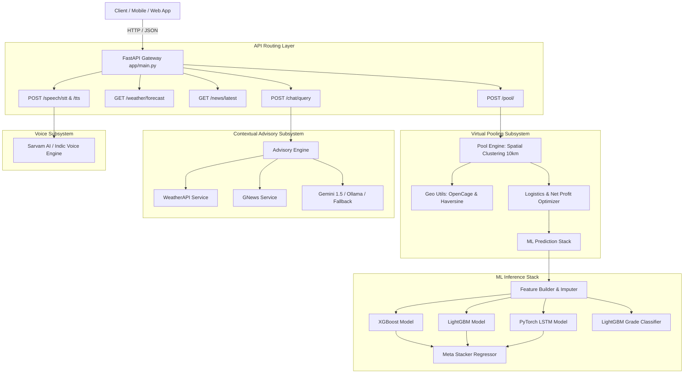
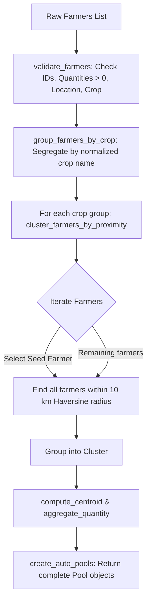
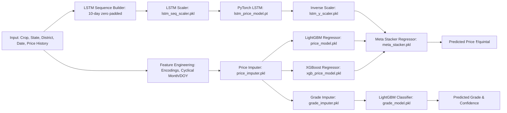

# 🌾 Fasal Nirnay (फसल निर्णय) — Comprehensive Backend Architecture & Codebase Documentation

---

## 📖 Table of Contents
1. [Executive Summary & High-Level Architecture](#1-executive-summary--high-level-architecture)
2. [Project & Directory Structure](#2-project--directory-structure)
3. [Configuration & Environment Management (`app/core/config.py`)](#3-configuration--environment-management-appcoreconfigpy)
4. [Data Schemas & Type Validation (`app/models/schemas.py`)](#4-data-schemas--type-validation-appmodelsschemaspy)
5. [Geographic Utilities & Spatial Engine (`app/utils/geo.py`)](#5-geographic-utilities--spatial-engine-apputilsgeopy)
6. [Virtual Produce Pooling Engine (`app/services/virtual_pooling/pool_engine.py`)](#6-virtual-produce-pooling-engine-appservicesvirtual_poolingpool_enginepy)
7. [Logistics & Mandi Net Profit Optimizer (`app/services/virtual_pooling/optimizer.py`)](#7-logistics--mandi-net-profit-optimizer-appservicesvirtual_poolingoptimizerpy)
8. [Hybrid Machine Learning Forecasting Pipeline (`app/services/prediction.py`)](#8-hybrid-machine-learning-forecasting-pipeline-appservicespredictionpy)
9. [Contextual Farming Advisory & Chat Engine (`app/services/chat_service.py`)](#9-contextual-farming-advisory--chat-engine-appserviceschat_servicepy)
10. [Weather & Agricultural News Services (`app/services/weather_service.py`, `app/services/news_service.py`)](#10-weather--agricultural-news-services)
11. [Indic Speech Processing Services (`app/services/speech_service.py`)](#11-indic-speech-processing-services-appservicesspeech_servicepy)
12. [API Routing Layer & Entry Point (`app/main.py` & `app/routes/`)](#12-api-routing-layer--entry-point)
13. [Testing Strategy & Test Suite (`test_*.py`)](#13-testing-strategy--test-suite)
14. [Execution Flow & System Diagrams](#14-execution-flow--system-diagrams)

---

## 1. Executive Summary & High-Level Architecture

**Fasal Nirnay (फसल निर्णय)** is a specialized, production-ready **FastAPI** backend engineered to solve key economic and informational challenges faced by smallholder farmers and Farmer Producer Organizations (FPOs) in India.

### Core Capabilities:
1. **Virtual Produce Pooling**: Automates spatial clustering of dispersed farmers within a 10 km geographic radius, aggregating crop volume into bulk loads.
2. **Logistics & Net Payout Optimization**: Computes truck-capacity-aware transport costs and selects the most profitable regional mandi based on net profit rather than gross price.
3. **Hybrid ML Price & Quality Grade Forecasting**: Combines tree-based ensembles (**XGBoost**, **LightGBM**) with deep learning time-series models (**PyTorch LSTM**) fed into a Meta-Stacker, alongside a LightGBM multi-class quality grade classifier (FAQ, Best, Common, Poor).
4. **Context-Aware Advisory Engine**: Multi-tier LLM pipeline (**Google Gemini 1.5 Flash** $\rightarrow$ **Local Ollama Llama 3** $\rightarrow$ **Rule-based fallback**) augmented with real-time weather and localized agricultural news.
5. **Indic Voice Interface**: Speech-to-Text (STT) and Text-to-Speech (TTS) integration designed for Indian languages (via Sarvam AI).



---

## 2. Project & Directory Structure

```
fasal-nirnay/
│
├── app/
│   ├── __init__.py                  # Package marker
│   ├── main.py                      # FastAPI app entry point, middleware & router inclusion
│   │
│   ├── core/
│   │   ├── __init__.py
│   │   └── config.py                # Environment configuration using Pydantic BaseSettings
│   │
│   ├── models/
│   │   ├── __init__.py
│   │   └── schemas.py               # Pydantic v2 data transfer objects (DTOs) & schemas
│   │
│   ├── routes/                      # API endpoint handlers (HTTP controller layer)
│   │   ├── __init__.py
│   │   ├── pooling.py               # POST /pool/ (Virtual Pooling & Optimization)
│   │   ├── weather.py               # GET /weather/forecast
│   │   ├── news.py                  # GET /news/latest
│   │   ├── chat.py                  # POST /chat/query
│   │   └── speech.py                # POST /speech/stt, POST /speech/tts
│   │
│   ├── services/                    # Business logic and external service integrations
│   │   ├── __init__.py
│   │   ├── prediction.py            # ML Model loading & ensemble inference pipeline
│   │   ├── weather_service.py       # WeatherAPI.com integration with resilient mock fallback
│   │   ├── news_service.py          # GNews API integration with search query builder
│   │   ├── chat_service.py          # Multi-tiered LLM advisory system
│   │   ├── speech_service.py        # Sarvam AI Indic STT and TTS service
│   │   └── virtual_pooling/
│   │       ├── __init__.py
│   │       ├── pool_engine.py       # 10 km proximity clustering, aggregation & centroid
│   │       └── optimizer.py         # Truck logistics cost calculation & net payout optimizer
│   │
│   └── utils/
│       ├── __init__.py
│       └── geo.py                   # OpenCage Geocoding, Haversine formula & Centroid math
│
├── .env.example                     # Environment variable template
├── requirements.txt                 # Project dependencies
├── conftest.py                      # Pytest fixtures and mock objects
├── test_geo.py                      # Tests for coordinates, distance, and geocoding
├── test_pool_engine.py              # Tests for clustering, validation, and pooling
├── test_optimizer.py                # Tests for transport equations and net pricing
├── test_pooling.py                  # End-to-end integration tests for POST /pool/
│
└── [Pre-trained ML Model Artifacts]
    ├── xgb_price_model.pkl          # Trained XGBoost regressor
    ├── price_model.pkl              # Trained LightGBM regressor
    ├── lstm_price_model.pt          # Trained PyTorch LSTM weights
    ├── meta_stacker.pkl             # Meta regressor combining XGB + LGB + LSTM
    ├── grade_model.pkl              # Trained LightGBM multi-class grade classifier
    ├── price_imputer.pkl            # Median imputer for price features
    ├── grade_imputer.pkl            # Median imputer for grade features
    ├── label_encoders.pkl           # Encoders for state, district, commodity, variety
    ├── grade_label_encoder.pkl      # Encoder for target quality grades
    ├── lstm_seq_scaler.pkl          # Input sequence scaler for LSTM
    └── lstm_y_scaler.pkl            # Output inverse scaler for LSTM
```

---

## 3. Configuration & Environment Management (`app/core/config.py`)

The application utilizes **Pydantic Settings (`BaseSettings`)** to manage application state and environment variables from a `.env` file in a type-safe manner.

### Key Settings Properties:
- `WEATHER_API_KEY`: API Key for WeatherAPI.com.
- `NEWS_API_KEY`: API Key for GNews.io.
- `GEMINI_API_KEY` & `GEMINI_MODEL`: Google Gemini API key and model designation (default: `gemini-1.5-flash`).
- `OLLAMA_BASE_URL` & `OLLAMA_MODEL`: Fallback local LLM endpoint (default: `http://localhost:11434`, model: `llama3`).
- `SPEECH_PROVIDER` & `SARVAM_API_KEY`: Speech backend selector (`"sarvam"`, `"google"`, or `"mock"`).
- `OPENCAGE_API_KEY`: API Key for OpenCage geocoding service.
- `MODEL_DIR`: Optional custom directory path for loading serialized ML `.pkl` and `.pt` files.
- `APP_ENV`, `APP_PORT`, `API_TITLE`, `API_VERSION`: Runtime metadata.

### Resilience Design:
All external API keys are configured as `Optional[str] = None`. When keys are absent, services automatically fall back to deterministic, structured mock generators, allowing developers to execute unit tests and develop offline without third-party API dependencies.

---

## 4. Data Schemas & Type Validation (`app/models/schemas.py`)

All API boundaries are guarded with **Pydantic v2** models, ensuring strict data validation and automated OpenAPI/Swagger schema generation.

### Schema Groups:

#### A. Virtual Pooling Schemas
- `Farmer`: Represents an individual farmer input:
  - `farmer_id: int`
  - `quantity: float` (enforced `gt=0` quintals)
  - `location: str` (village, district, or city name)
  - `crop: str` (e.g., `"wheat"`, `"mustard"`, `"onion"`)
- `PoolRequest`: Contains `farmers: List[Farmer]` and optional `price_history: Optional[List[float]]`.
- `Centroid`: Geographic center coordinates (`lat: float`, `lon: float`).
- `PoolRecommendation`: Breakdown of best mandi decision:
  - `mandi`: Target mandi name
  - `price` / `predicted_price`: Base predicted market price (₹/quintal)
  - `grade`: Predicted quality grade (e.g., `"FAQ"`, `"Best"`, `"Common"`)
  - `grade_multiplier`: Quality price scaling coefficient
  - `grade_confidence`: Classifier probability score
  - `effective_price`: Quality-adjusted price ($\text{price} \times \text{multiplier}$)
  - `distance_km`: Haversine distance from centroid to mandi
  - `trucks_needed`: Total 200-quintal capacity trucks allocated
  - `transport_cost`: Freight logistics cost per quintal (₹/quintal)
  - `net_price`: Net payout to farmers ($\text{effective\_price} - \text{transport\_cost}$)
- `PoolResult` & `PoolResponse`: Hierarchical response models containing all formed pools and overall metadata.

#### B. Advisory, Weather & Speech Schemas
- `WeatherResponse` & `ForecastDay`: Daily forecast items (max/min temp, condition, rain percentage).
- `NewsResponse` & `NewsArticle`: Structured news articles with publication timestamps and URLs.
- `ChatRequest` & `ChatResponse`: Farmer inquiry, language preference, toggles for context injection, and answer with `context_used` metadata.
- `STTRequest` / `STTResponse`: Base64 audio input to transcribed text with confidence.
- `TTSRequest` / `TTSResponse`: Text input to Base64 audio WAV output with voice gender configuration.

---

## 5. Geographic Utilities & Spatial Engine (`app/utils/geo.py`)

Geographic calculations are fundamental to pooling and transport cost estimation.

### Functions & Mechanics:

1. **`get_coordinates(place: str) -> Tuple[float, float]`**:
   - Implements a 3-tier lookup hierarchy:
     1. **In-Memory Cache**: `location_cache` dictionary to prevent duplicate HTTP requests.
     2. **OpenCage Geocoding API**: Queries `https://api.opencagedata.com/geocode/v1/json` constrained to `countrycode=in`.
     3. **Fallback Agricultural Coordinates**: Hardcoded coordinates for common North/Western Indian mandis and districts (`delhi`, `jhajjar`, `rohtak`, `bahadurgarh`, `karnal`, `sonipat`, `hisar`, `jaipur`, `alwar`, `pune`, `nashik`).

2. **`haversine(lat1, lon1, lat2, lon2) -> float`**:
   - Computes great-circle distance between two spherical points on Earth (radius $R = 6371\text{ km}$):
   $$a = \sin^2\left(\frac{\Delta\text{lat}}{2}\right) + \cos(\text{lat}_1)\cos(\text{lat}_2)\sin^2\left(\frac{\Delta\text{lon}}{2}\right)$$
   $$c = 2 \cdot \text{atan2}\left(\sqrt{a}, \sqrt{1-a}\right)$$
   $$d = R \cdot c$$

3. **`compute_centroid(farmers: list) -> Tuple[float, float]`**:
   - Calculates the arithmetic mean coordinate $(\bar{\text{lat}}, \bar{\text{lon}})$ across all farmer locations in a cluster to serve as the unified pickup/dispatch node.

---

## 6. Virtual Produce Pooling Engine (`app/services/virtual_pooling/pool_engine.py`)

Responsible for input validation, commodity segregation, spatial clustering, and metadata aggregation.

### Core Workflow:



### Clustering Details (`cluster_farmers_by_proximity`):
- **Seed-Based Spatial Partitioning**: Sets `MAX_RADIUS_KM = 10.0`.
- Takes the first unclustered farmer as a cluster seed.
- Computes Haversine distance from the seed to all remaining farmers.
- All farmers within $\le 10\text{ km}$ are joined into the current cluster.
- Remaining farmers $> 10\text{ km}$ away form subsequent clusters iteratively.
- Result: Farmers producing the same crop who are geographically distant are partitioned into distinct, logistics-viable pools.

---

## 7. Logistics & Mandi Net Profit Optimizer (`app/services/virtual_pooling/optimizer.py`)

The optimizer converts gross market price forecasts into actionable net profits by modeling real-world freight and crop quality factors.

### 1. Mandi Geographic Directory (`MANDI_COORDINATES`):
Maintains latitude/longitude for regional mandis:
- **Azadpur (Delhi)**: `(28.7333, 77.1667)`
- **Karnal (Haryana)**: `(29.6857, 76.9905)`
- **Rohtak (Haryana)**: `(28.8955, 76.6066)`
- **Najafgarh (Delhi)**: `(28.6092, 76.9798)`
- **Jaipur (Rajasthan)**: `(26.9124, 75.7873)`
- **Alwar (Rajasthan)**: `(27.5530, 76.6346)`
- **Hisar (Haryana)**: `(29.1492, 75.7217)`
- **Sonipat (Haryana)**: `(28.9929, 77.0151)`

### 2. Crop Quality Grade Multiplier Table (`GRADE_MULTIPLIER`):
Adjusts gross prices based on quality standard classification:
- **Best**: `1.05` (+5% premium)
- **FAQ** (Fair Average Quality): `1.00` (Baseline)
- **Common**: `0.92` (-8% discount)
- **Poor**: `0.80` (-20% discount)

### 3. Freight Logistics Model:
- Standard Commercial Truck Capacity: $C = 200\text{ quintals}$
- Base Truck Freight Rate: $R = \text{₹}25\text{ per km per truck}$

$$\text{num\_trucks} = \left\lceil \frac{\text{quantity}}{C} \right\rceil$$
$$\text{total\_transport\_cost} = \text{num\_trucks} \times R \times \text{distance}$$
$$\text{transport\_cost\_per\_quintal} = \frac{\text{total\_transport\_cost}}{\text{quantity}}$$

### 4. Net Payout Equation:
$$\text{effective\_price} = \text{predicted\_price} \times \text{grade\_multiplier}$$
$$\text{net\_price} = \text{effective\_price} - \text{transport\_cost\_per\_quintal}$$
$$\text{total\_pool\_earnings} = \text{net\_price} \times \text{total\_quantity}$$

### 5. Mandi Optimization (`optimize_pool`):
Iterates through all candidate mandis, calculates the distance from the pool centroid, determines the net payout, and selects the mandi maximizing $\text{net\_price}$.

---

## 8. Hybrid Machine Learning Forecasting Pipeline (`app/services/prediction.py`)

The ML pipeline is architected as a stacked ensemble designed for agricultural tabular and sequential price data.

### Model Discovery (`find_model_file`):
Searches multiple candidate paths dynamically (custom `MODEL_DIR`, relative `models/`, root, and current working directory), allowing seamless execution across different environments.

### The Hybrid Model Architecture:



### 1. PyTorch LSTM Architecture (`LSTMModel`):
```python
class LSTMModel(nn.Module):
    def __init__(self):
        super().__init__()
        self.lstm = nn.LSTM(input_size=1, hidden_size=50, batch_first=True)
        self.fc   = nn.Linear(50, 1)

    def forward(self, x):
        out, _ = self.lstm(x)
        return self.fc(out[:, -1, :])
```
- Takes a sequence of past daily prices $(1, 10, 1)$ with left-zero-padding.
- Extracts temporal price trajectory embeddings to capture sudden market momentum.

### 2. Feature Engineering (`build_features`):
- **Categorical Encodings**: `safe_encode()` converts commodity, variety, state, and district using `label_encoders.pkl` (unseen categories safely default to bucket `0`).
- **Cyclical Temporal Features**:
  $$\text{month\_sin} = \sin\left(\frac{2\pi \cdot \text{month}}{12}\right), \quad \text{month\_cos} = \cos\left(\frac{2\pi \cdot \text{month}}{12}\right)$$
  $$\text{doy\_sin} = \sin\left(\frac{2\pi \cdot \text{doy}}{365}\right), \quad \text{doy\_cos} = \cos\left(\frac{2\pi \cdot \text{doy}}{365}\right)$$
- **Weather & Lagged Price Placeholders**: Median-imputed during inference.

### 3. Quality Grade Classification (`predict_grade`):
- Uses `grade_model.pkl` to output class probabilities across `["FAQ", "Best", "Common", "Poor"]` and returns the top predicted grade and its confidence score.

### 4. Intelligent Baseline Fallback (`BASELINE_CROP_PRICES`):
If ML weight files are absent, the service falls back to a deterministic baseline pricing dictionary for standard Indian crops (Wheat ₹2275, Mustard ₹5650, Gram ₹5440, Rice ₹2183, Cotton ₹7020, etc.) with slight deterministic regional variance, ensuring uninterrupted system availability.

---

## 9. Contextual Farming Advisory & Chat Engine (`app/services/chat_service.py`)

The chat service generates personalized agricultural advisories by combining LLMs with real-time ground context.

### Context Augmentation Flow:
1. **Weather Context**: Ingests current temperature, condition, humidity, and wind speed from `get_weather_forecast`.
2. **News Context**: Ingests top regional headlines from `get_latest_news`.
3. **System Prompt Construction**: Instructs the model to act as an expert agronomist delivering actionable advice in the requested language (e.g., Hindi, Marathi, English).

### Multi-Tier Fallback Hierarchy:
1. **Tier 1 (Primary)**: Google Gemini API (`gemini-1.5-flash`) using direct REST invocation.
2. **Tier 2 (Secondary)**: Local Ollama instance (`http://localhost:11434/api/generate` with `llama3`).
3. **Tier 3 (Offline / Fallback)**: Deterministic mock agronomist advisory covering soil moisture, pest inspection, and fertilization schedules.

---

## 10. Weather & Agricultural News Services

### Weather Service (`app/services/weather_service.py`)
- Integrates with **WeatherAPI.com** (`http://api.weatherapi.com/v1/forecast.json`).
- Normalizes raw vendor JSON into uniform `ForecastDay` models.
- Gracefully supplies realistic 3-day agricultural forecast mock data when no API key is present.

### News Service (`app/services/news_service.py`)
- Integrates with **GNews API** (`https://gnews.io/api/v4/search`).
- Dynamically constructs targeted search queries: `"{crop} {location} agriculture farming {category}"` constrained to Indian news sources (`country=in`).
- Normalizes article payloads to `title`, `description`, `source`, `published_at`, and `url`.

---

## 11. Indic Speech Processing Services (`app/services/speech_service.py`)

Designed to overcome literacy barriers among rural farmers through voice I/O.

- **Target Provider**: **Sarvam AI** (`saarika:v2` for STT and `bulbul:v2` for TTS).
- **Supported Languages**: Hindi (`hi-IN`), Marathi (`mr-IN`), Bengali (`bn-IN`), Tamil (`ta-IN`), Telugu (`te-IN`), Kannada (`kn-IN`), Gujarati (`gu-IN`), Punjabi (`pa-IN`), and Indian English (`en-IN`).
- **STT Pipeline**: Accepts Base64 encoded audio $\rightarrow$ Decodes bytes $\rightarrow$ Multipart upload to Sarvam $\rightarrow$ Returns Hindi/regional transcript.
- **TTS Pipeline**: Accepts regional text + speaker preference (e.g., `"meera"` female, `"arjun"` male) $\rightarrow$ Returns Base64-encoded WAV audio.

---

## 12. API Routing Layer & Entry Point

### `app/main.py`
- Instantiates FastAPI with OpenAPI metadata.
- Configures permissive **CORS** middleware (`allow_origins=["*"]`) for web and mobile clients.
- Registers route modules with explicit prefixes:
  - `/weather` $\rightarrow` `weather.router`
  - `/news` $\rightarrow` `news.router`
  - `/chat` $\rightarrow` `chat.router`
  - `/speech` $\rightarrow` `speech.router`
  - `/pool` $\rightarrow` `pooling.router`
- Exposes root sanity check (`GET /`) and platform health check (`GET /health`).

### Summary of REST Endpoints:

| Method | Path | Summary | Description |
|---|---|---|---|
| `GET` | `/` | Root | Service info & documentation link |
| `GET` | `/health` | Health Check | System uptime & environment check |
| `POST` | `/pool/` | Virtual Pooling | Geo-clustering, ML price inference & mandi profit optimizer |
| `GET` | `/weather/forecast` | Weather Forecast | Multi-day weather forecast for crops and regions |
| `GET` | `/news/latest` | Agricultural News | Filtered news on mandi trends, schemes, and weather |
| `POST` | `/chat/query` | AI Advisory Chat | Context-aware LLM advisory chatbot |
| `POST` | `/speech/stt` | Speech-to-Text | Transcribes regional audio to text |
| `POST` | `/speech/tts` | Text-to-Speech | Synthesizes regional text into audio speech |

---

## 13. Testing Strategy & Test Suite

The codebase includes a comprehensive **pytest** automated test suite:

1. **`test_geo.py`**:
   - Validates Haversine spherical distance calculations against known geodesic benchmarks.
   - Tests arithmetic centroid computation across multiple coordinates.
   - Tests in-memory coordinate caching and fallback behavior for unresolvable location names.

2. **`test_pool_engine.py`**:
   - Validates farmer payload structures and rejects non-positive quantities.
   - Verifies grouping by crop name (case-insensitive).
   - Tests 10 km proximity clustering boundary conditions (ensuring farmers $> 10\text{ km}$ apart are split into separate pools).

3. **`test_optimizer.py`**:
   - Validates step-function truck allocation math ($\lceil Q / 200 \rceil$).
   - Verifies per-quintal freight cost behavior and economy of scale.
   - Checks grade multiplier price adjustments (+5% for Best, -8% for Common).
   - Confirms selection of the optimal mandi based on net profit.

4. **`test_pooling.py`**:
   - End-to-end integration tests on `POST /pool/` using FastAPI's `TestClient`.
   - Validates HTTP 200 response formats, multi-crop/multi-pool partitioning, and HTTP 400/422 validation error handling.

---

## 14. Execution Flow & System Diagrams

### End-to-End Virtual Pooling & Mandi Recommendation Flow:

```mermaid
sequenceDiagram
    autonumber
    actor FarmerApp as Farmer / FPO App
    participant Route as routes/pooling.py
    participant Engine as pool_engine.py
    participant Geo as utils/geo.py
    participant ML as services/prediction.py
    participant Opt as optimizer.py

    FarmerApp->>Route: POST /pool/ (Farmers list, quantities, locations, crop)
    Route->>Engine: create_auto_pools(farmers)
    Engine->>Geo: get_coordinates(location) for each farmer
    Geo-->>Engine: (lat, lon)
    Engine->>Engine: Cluster farmers within 10 km radius
    Engine->>Geo: compute_centroid(cluster)
    Geo-->>Engine: centroid (lat, lon)
    Engine-->>Route: List of formed pools

    loop For Each Pool
        Route->>ML: get_mandi_predictions(crop, price_history)
        ML->>ML: Run XGBoost + LightGBM + LSTM Stack
        ML->>ML: Run LightGBM Grade Classifier
        ML-->>Route: Candidate mandis (price, grade, confidence)
        Route->>Opt: optimize_pool(pool, mandi_data)
        Opt->>Geo: haversine(centroid, mandi_coords)
        Opt->>Opt: Compute effective_price & transport_cost
        Opt->>Opt: Select Mandi with MAX(net_price)
        Opt-->>Route: Pool recommendation & total earnings
    end

    Route-->>FarmerApp: 200 OK (Pools, Recommended Mandis, Net Profits)
```

---

*Fasal Nirnay (फसल निर्णय) — Technical Architecture Documentation.*
